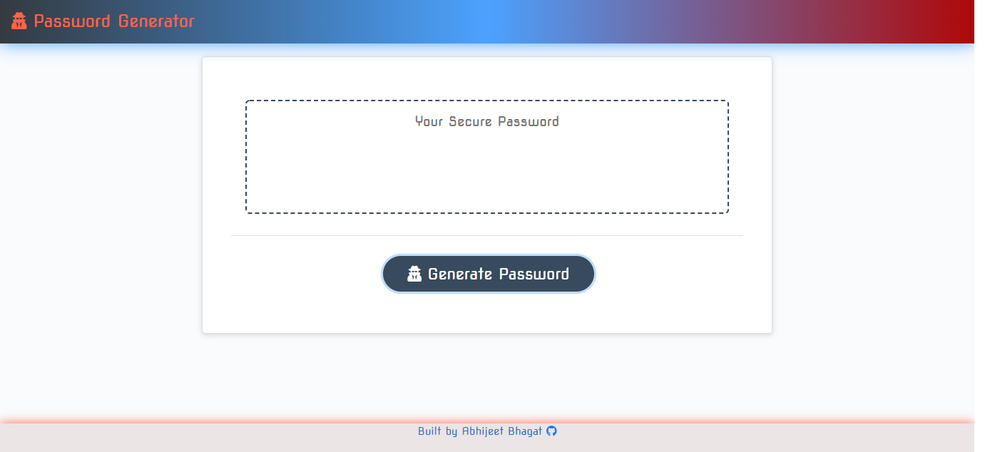
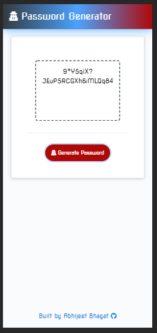
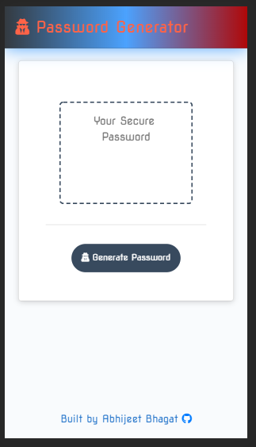
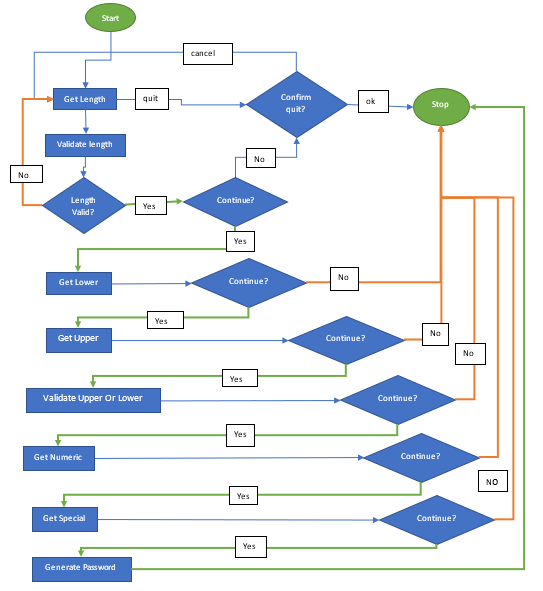

# passwordgenerator

 An application that generates a random password based on user-selected criteria. This runs in the browser and feature dynamically updated HTML and CSS powered by JavaScript code. The app has a responsive clean and polished user interface, ensuring that it adapts to multiple screen sizes.

 <div align="center">
 
 </div>

# how it works

 * Password Generator gets your preferences for password via a series of prompts and confirmations.
* **After every criteria selection** the user is **given ability to quit** or continue.
* once all confirmations and prompts for criteria are answered. Password Generator then generates a random password and displays it on UI.

# Demo

 <div align="center">
 
 </div>

# Author and Deployment details
* Deployed : [Git Hub Pages](https://bhagatabhijeet.github.io/passwordgenerator/index.html)
* Repository : [Git Hub](https://github.com/bhagatabhijeet/passwordgenerator)
* Coded By : Abhijeet Bhagat([Git Hub Profile](https://github.com/bhagatabhijeet))

# Some Screen Shots
<div align="center">
Full Browser
 
 <table>
 <tr>
 <td>iPhone x</td><td>Samsung Galaxy S5</td>
 </tr>
 <tr>
 <td></td>
 <td></td>
 </tr>
 </table>
 </div>_

# Technical Requirements and Use Cases:

## Flow Cart

 <div align="center">
 
 </div>

## User Story

```
AS AN employee with access to sensitive data
I WANT to randomly generate a password that meets certain criteria
SO THAT I can create a strong password that provides greater security
```

## Acceptance Criteria

```
GIVEN I need a new, secure password
WHEN I click the button to generate a password
THEN I am presented with a series of prompts for password criteria
WHEN prompted for password criteria
THEN I select which criteria to include in the password
WHEN prompted for the length of the password
THEN I choose a length of at least 8 characters and no more than 128 characters
WHEN prompted for character types to include in the password
THEN I choose lowercase, uppercase, numeric, and/or special characters
WHEN I answer each prompt
THEN my input should be validated and at least one character type should be selected
WHEN all prompts are answered
THEN a password is generated that matches the selected criteria
WHEN the password is generated
THEN the password is either displayed in an alert or written to the page
```